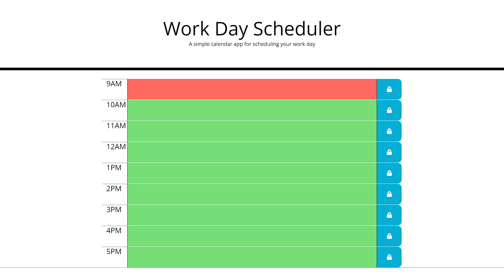

# Work Day Scheduler Starter Code

## Project Description
    This work-day-scheduler application was created using Jquery and Bootstrap. You can schedule out your work day and have the data persist upon refresh using localStorage. The time blocks also change color depending on the current time. 

## Production Link
[website](https://blitman12.github.io/Work-Day-Scheduler/)

## Screenshot

## License
* © 2021 Bradley Litman 
